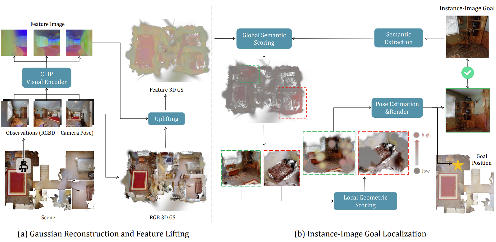
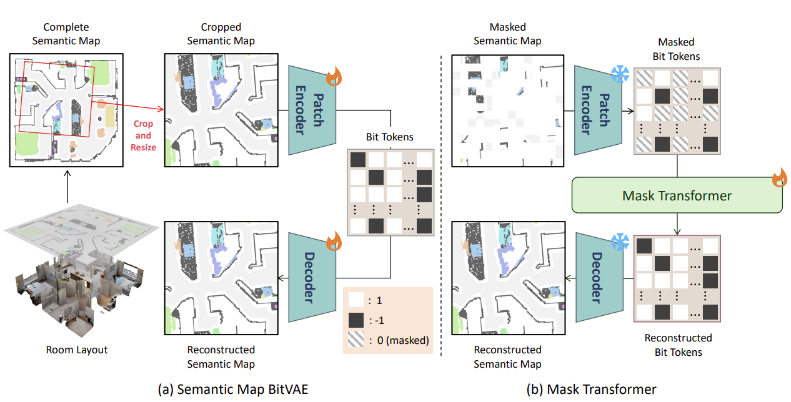
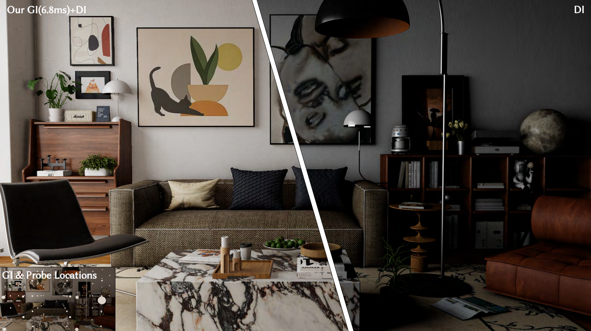

I am a second year PhD student at Tandon School of Engineering of New York University, working with [Prof. Yi Fang](https://scholar.google.com/citations?user=j-cyhzwAAAAJ&hl=en). Before this, I got my Master's degree in Data Science and Information Technology at TBSI, Tsinghua University, supervised by [Prof. Lu Fang](https://www.luvision.net/). And I got my Bachelor's degree at Computer School of Wuhan University.

**My research interests are robotics, 3D vision and world model**, especially:

- Intelligent embodied robot navigation with various goals.
- Leverage 3D information (point cloud, gaussian splatting) to help robots have better performance.
- Robot foundation world modeling.

---

News
======

- [August. 2025] My paper [TransGI](https://ieeexplore.ieee.org/abstract/document/11134500) is accepted by IEEE TVCG! 

---

Publications
======
<table>
	<tr>
    <td valign="top">  </td>
    <td>            
    	
<b>Hierarchical Scoring with 3D Gaussian Splatting for Instance Image-Goal Navigation</b>

   		<b>Yijie Deng</b>*, <b>Shuaihang Yuan</b>*, Geeta Chandra Raju Bethala, Anthony Tzes, Yu-Shen Liu
        
(ArXiv 2025) 

        
 [<a href="https://arxiv.org/abs/2506.07338">ArXiv</a>]

    </td>
  </tr>

  <tr>
    <td valign="top">  </td>
    <td>            
    	
<b>MapBERT: Bitwise Masked Modeling for Real-Time Semantic Mapping Generation</b>

    	<b>Yijie Deng</b>*, <b>Shuaihang Yuan</b>*, Congcong Wen, Hao Huang, Anthony Tzes, Geeta Chandra Raju Bethala, Yi Fang
        
(ArXiv 2025) 

        
 [<a href="https://arxiv.org/abs/2506.07350">ArXiv</a>]

    </td>
  </tr>

  <tr>
    <td valign="top">  </td>
    <td>            
    	
<b>TransGI: Real-Time Dynamic Global Illumination With Object-Centric Neural Transfer Model</b>

    	<b>Yijie Deng</b>, Lei Han, Lu Fang
        
(IEEE TVCG) 

        
 
          [<a href="https://ieeexplore.ieee.org/abstract/document/11134500">Paper</a>] 
          [<a href="https://arxiv.org/abs/2506.09909">Arxiv</a>]
        

    </td>
  </tr>

  <tr>
    <td valign="top">  </td>
    <td>            
    	
<b>RealLiFe: Real-Time Light Field Reconstruction via Hierarchical Sparse Gradient Descent</b>

    	<b>Yijie Deng</b>*, <b>Lei Han</b>*, Tianpeng Lin, Lin Li, Jinzhi Zhang, Lu Fang
        
(ArXiv 2025) 

        
 [<a href="https://arxiv.org/abs/2307.03017">ArXiv</a>]

    </td>
  </tr>

</table>

---

Research Experience
======

### Indoor Gaussian Splatting-based Image-Goal Navigation   

January 2025 - June 2025

- Developed a gaussian splatting-based indoor instance image goal navigation method that can accurately locate the target image in a big indoor scene.
- Build the appearance and feature gaussian splatting of a scene using a self-explored agent. And then use a hierarchical scoring method to locate the target image in both global semantic-level and local geometric-level.
- Achieve the sota instance image goal navigation success rate compared to baseline methods, and is applied to a humanoid robot to prove its real-world application on real robots.

### Indoor Object-Goal Navigation

September 2024 - December 2024

- Developed real-time indoor map generation method for efficient object-goal navigation.
- Leverage the bit-wise autoencoder to learn the map patterns of the BEV map of indoor scenes and a masked transformer to imagine the unexplored indoor map to discover the targets in advance.
- Achieve real-time map generation speed and the sota object navigation success rate.

### Real-Time Cloud Rendering

April 2023 - March 2024

- Developed a novel rendering system, designed specifically for high-quality, real-time graphics on low-end devices using cloud-based powerful GPUs.
- Innovated in compression techniques and rendering effect decomposition, creating a compact representation for object-centric radiance transfer fields. This approach enables efficient, user-independent global illumination with low-frequency detail, alongside shared specular importance sampling for dynamic, high-frequency reflections.
- Utilized Mitsuba3 rendering engine for demonstrating capabilities in Python, achieving 5 FPS at 1920x1080 resolution, maintaining quality comparable to ray tracing. Currently implementing a real-time demo using NVIDIA Falcor and CUDA for enhanced performance and efficiency.

### Real-Time Light Field Reconstruction via Hierarchical SGD

October 2022 - April 2023

- Develop an algorithm for real-time light field video generation supporting 3D display and VR devices.
- Employed sparse light field gradients to boost performance for a balanced trade-off between quality and efficiency.
- Achieved by far the fastest light field generation methods 400x faster than the baseline DeepView with a 2 dB higher PSNR compared to baseline novel view synthesis methods (IBRNet, MVSNeRF, ENeRF).

---

# Education

- **PhD., Computer Science and Robotics**

  September 2024 - Present, New York University, US.

- **M.Phil., Data Science and Information Technology**

  September 2021 - June 2024, Tsinghua University, China.

- **B.Eng., Computer Science**

  September 2017 - June 2021, Wuha University, China.

---

# Honors & Awards

- 2021, Outstanding Graduate in School of Computer Science
- 2019, National English Competition for College Students, Second Prize of Hubei Province
- 2017-2021, National Encouragement Scholarship
- 2017-2021, First-class Scholarship for Excellent Students
- 2018, National Mathematics Competition for College Students, Second Prize of Hubei Province
- 2018, Nationally Televised CCTV New Hope English Speech Competition, First Prize of Hubei Province

